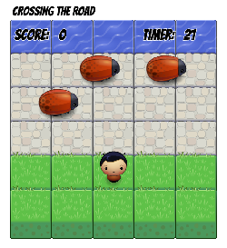
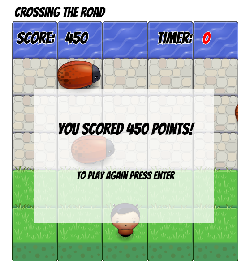

# Classic Arcade Game Clone
### Frontend Nanodegree Project 3
| Start Screen | Game Play | Game Over |
| --- | --- | --- |
|  |  |  |

#### Game Overview

On the start screen, hit enter to start the game.

- Use the arrow keys to move the player.
- Move the player across the stone road to reach the water.
- You earn 100 points for every time you reach the water.
- Avoid the bugs as you cross the road.
- Every time you hit a bug you lose 50 points and move back to starting position
- The timer is set for 30 seconds. Go for your personal best (store locally).
- Press enter to start a new game.

#### Game Mechanics

##### Code Organization
- Implemented commonJS modules in browser with browserify/watchify
- File Structure
  - bundle.js 
    - Concatenated javascript files 
  - engine.js 
    - Entry point for program. Main game loop.
  - engine_logic/
    - render, resets, state_checks, subscriptions, and updates
  - game_objects/ 
    - Enemy and Player classes, high_scores, instantiate_entities, score, timer
  - graphics_objects/
    - canvas, start_screen, graphics_objects
  - state_handling/ 
    - Event_handler class, eventlisteners, collision_handler, gamestate_handler, state_pubsub
  - utilities/
    - datastorage, landmarks, render_helper, resources
