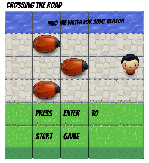

# Classic Arcade Game Clone
### Frontend Nanodegree Project 3

#### Game Overview

On the start screen, hit enter to start the game.

- Use the arrow keys to move the player.
- Move the player across the stone road to reach the water.
- You earn 100 points for every time you reach the water.
- Avoid the bugs as you cross the road.
- Every time you hit a bug you lose 50 points and move back to starting position
- The timer is set for 30 seconds. Go for your personal best (store locally).

